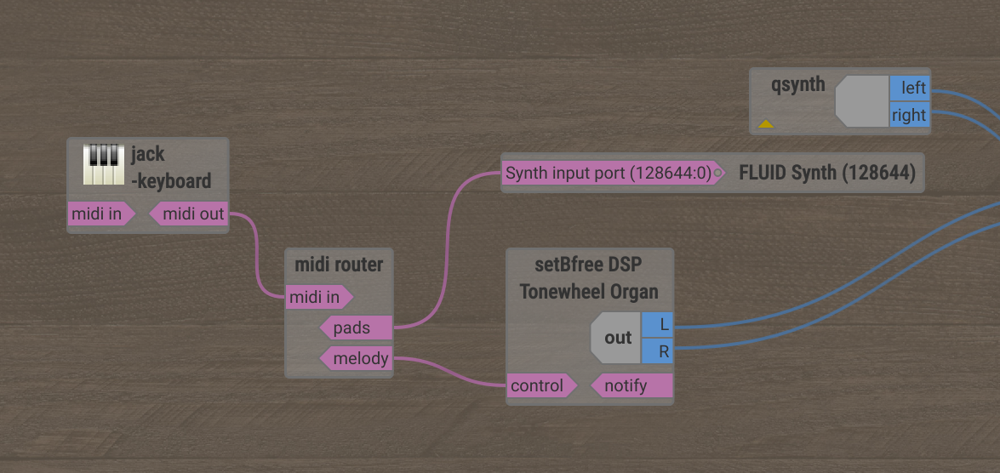

# MIDI Router

This MIDI router is a command-line application to route MIDI signals to one or multiple
targets. Use cases include, among others:

  - control different VST plugins with different parts of the MIDI controller
    (e.g., split keyboard)
  - send MIDI signals to multiple VST plugins simultaneously
  - suppress certain MIDI signals

## Compilation

The code can be compiled with `cargo` as follows:

```bash
cargo build --release
```

The resulting executable is located in the folder `target/release/midi_router`.
This application was tested with Rust version 1.82.0. 

## Usage

Simply run the executable in a terminal window with

```bash
target/release/midi_router <CONFIG_FILE>
```

The first (and only) argument `<CONFIG_FILE>` is the path to a config file.
The format of the configuration file is detailed in the [configuration 
section](#configuration).

When started successfully, the application waits for incoming MIDI signals to
forward.
You can use a third-party patch bay application, such as 
[qjackctl](https://qjackctl.sourceforge.io/), 
[Patchance](https://github.com/Houston4444/Patchance), or
[Carla](https://github.com/falkTX/Carla), 
to connect the input and output ports with instruments and/or VSTs.

To terminate, press either <kbd>ENTER</kbd> or <kbd>CTRL</kbd> + <kbd>c</kbd>.


## Configuration

The config file is a simple text file which defines the routing rules for incoming
MIDI signals. It uses a line-based format where each non-empty line contains exactly
one rule of the form:

```text
<CONDITION> => <PORTS>
```

`<CONDITION>` defines to which MIDI signals the rule is applied to.
`<PORTS>` is an optional space-separated list of port names where matching MIDI signals 
are forwarded to. Port names can be chosen arbitrarily. If no output ports are given or
no condition matches, then the matching MIDI signal will be dropped.

MIDI signals can be filtered on one or multiple of the following properties:

  - MIDI signal type (e.g., note-on, note-off, ...)
  - MIDI channel (1 to 16)
  - Value (semantics and value range depend on signal type):
    - Note number
    - Pitch bender value
    - Control function
    - Program
  - Velocity, pressure, control or program no.

A condition has the following format:

```text
<EVENT_NAME_PATTERN> [ch<N>] [<N>] [vel<N>] [ctrl<N>]
```

The event name pattern `<EVENT_NAME_PATTERN>` defines the name of the event of the 
target MIDI signal. It can be either the literal event name or a valid [regular 
expression](https://docs.rs/regex/latest/regex/#syntax). The following MIDI signal
types are supported:

| MIDI signal type          | Signal name (pattern)    | Value meaning      | Value range  | Attributes |
|---------------------------|--------------------------|--------------------|--------------|------------|
| Note on                   | note-on                  | Note number        | 0 - 127      | ch, vel    |
| Note off                  | note-off                 | Note number        | 0 - 127      | ch, vel    |
| Polyphonic Aftertouch     | polyphonic-aftertouch    | Note number        | 0 - 127      | ch, vel    |
| Control/Mode change       | control-change           | Control value      | 0 - 127      | ch, ctrl   |
| Program change            | program-change           | Program number     | 0 - 127      | ch         |
| Channel aftertouch        | channel-aftertouch       | Pressure           | 0 - 127      | ch         |
| Pitch bend change         | pitch-bend-change        | Pitch bender value | -8192 - 8191 | ch         |
| System exclusive          | system-exclusive         |                    |              |            |
| MIDI time code qtr. frame | midi-time-code-qtr-frame |                    |              |            |
| Song position pointer     | song-position-pointer    |                    |              |            |
| Song select               | song-select              |                    |              |            |
| Tune request              | tune-request             |                    |              |            |
| End of SysEx (EOX)        | end-of-sys-ex            |                    |              |            |
| Timing clock              | timing-clock             |                    |              |            |
| Start                     | start                    |                    |              |            |
| Continue                  | continue                 |                    |              |            |
| Stop                      | stop                     |                    |              |            |
| Active sensing            | active-sensing           |                    |              |            |
| System reset              | system-reset             |                    |              |            |

For example, the pattern `note-.*` will match `note-on` and `note-off` events.

The channel is given by `ch<N>`, where `<N>` stands for a number between 1 and 16.
If not specified, any channel will match.
For example, `ch5` will match MIDI events on MIDI channel 5.

The velocity is likewise given by `vel<N>`, where `<N>` is a number between 0 
and 127. If not specified, any velocity will match.
For example, `vel120` will match MIDI events with an exact velocity of 120.

`ctrl<N>` defines the [control function](https://midi.org/midi-1-0-control-change-messages) 
for a control/mode change event. Its values range from 0 to 127.
If not specified, any control value will match.

A number without prefix, i.e., the `<N>` without prefix in above example, defines 
the value of an event. The meaning of this value and its value range depends on the
signal type. See above table for further information.
If not specified, any value will match.

Each number `<N>` can be optionally prefixed with either `<` (less than) or `>` 
(greater than) to define value ranges. 
Alternatively, value ranges can be defined by the start and end of that range, for 
example, `2-4` matches 2, 3, and 4.
A `*` instead of a number simply means "any value".

The rules are processed from top to bottom. The router will apply all rules that
match a given MIDI signal. A MIDI signal will be sent to a port multiple times if 
it appears multiple times within a rule or among different rules.

## Example Configuration

The following example configuration splits a keyboard into two parts: one for playing
pads with the left hand and one for playing the melody with the right hand:

```text
note-.* ch1-8 <60 => pads
note-.* ch1-8 >59 => melody
```

When running `midi_router` with this configuration, all "Note on" and "Note off"
events on channels 1 to 8 with a note less than 60 are routed to the port named 
"pads" and all notes greater than 59 to the port "melody". In Patchance, the
midi router application is then represented as follows:



## Future Plans

- [ ] Packaging
- [ ] Simple GUI frontend
- [ ] Auto-connect with other MIDI ports upon startup